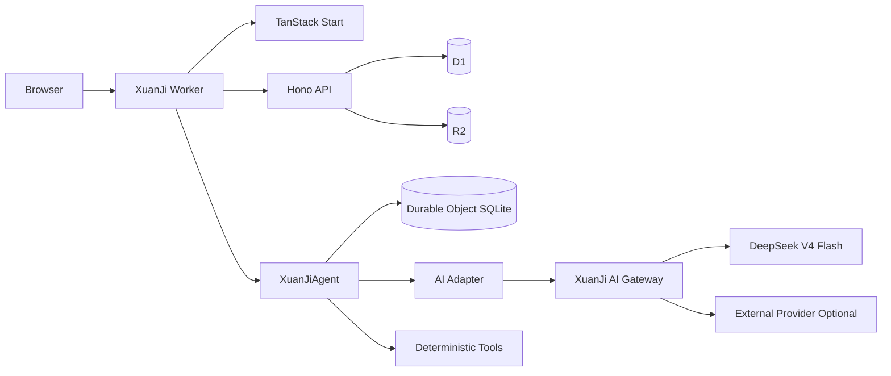

# 1. 项目定义

XuanJi 是一个开源的 AI 命理与运势项目。首版目标不是覆盖所有术数，而是先证明一条完整链路：

1. 用户填写出生资料。
2. 确定性计算器生成可重复的命盘事实。
3. 规则层从事实中选出重点。
4. AI 通过 XuanJi 专用 AI Gateway 生成结构化解读。
5. 用户可以查看命盘、报告并继续追问。

这是一个单人开发、快速验证主要功能的 MVP。首版只建设核心产品链路，不建设外围治理或复杂运营系统。

# 2. MVP 范围

## 2.1 P0：第一版必须完成

- 单 Worker Cloudflare 全栈骨架。
- XuanJi 专用 AI Gateway 接入。
- 出生日期、时间、地点和方法配置录入。
- 时间标准化、时区和 DST 处理。
- 八字确定性排盘。
- Chart Snapshot 与计算版本记录。
- 核心规则、Evidence 和结构化报告。
- AI 解读、流式输出和连续追问。
- 历史命盘和报告列表。
- 基础 Golden Cases、单元测试和集成测试。

## 2.2 P1：P0 稳定后

- 西方本命盘。
- 当前行运。
- 太阳星座日运和生肖日运。
- SVG 命盘展示。
- 报告分享图和 PDF。

## 2.3 暂不进入 MVP

- 紫微斗数、塔罗、易经、合盘和综合术数报告。
- 支付、订阅、配额和会员等级。
- 管理后台和内容审核后台。
- 通用向量 RAG。
- 允许 Agent 执行任意脚本或浏览互联网。

# 3. 产品原则

## 3.1 计算与解释分离

系统输出分为三层：

1. `Facts`：历法、四柱、节气、十神、五行、行星、宫位和相位等确定性结果。
2. `Rules/Evidence`：在指定方法配置下触发的规则和依据。
3. `Reading`：AI 对 Facts 和 Evidence 的组织、归纳和表达。

AI 不负责计算四柱、节气、宫位或相位。缺少 Tool 结果时，不生成相应事实。

## 3.2 方法配置显式化

八字首版至少记录：

- 换年方式。
- 换日边界。
- 民用时或真太阳时。
- 起运方向与起运算法版本。

西方占星首版至少记录：

- Tropical 或 Sidereal。
- 宫制。
- 相位容许度版本。
- 交点和逆行计算版本。

## 3.3 Snapshot 不可变

同一输入、方法和引擎版本生成一个不可变 Chart Snapshot。规则、报告和聊天都引用 Snapshot，不在追问过程中重新排盘。

# 4. 核心用户流程

## 4.1 首次生成八字报告

```text
首页
  -> 新建出生资料
  -> 确认时间、地点和方法
  -> 生成八字 Chart Snapshot
  -> 展示排盘与关键 Facts
  -> 生成结构化 AI 报告
  -> 继续追问
```

## 4.2 查看历史结果

```text
历史列表
  -> 选择出生资料
  -> 选择 Chart Snapshot
  -> 查看报告或继续原对话
```

## 4.3 日运

```text
Scheduled Handler
  -> 生成当天结构化信号
  -> AI Gateway 生成日运内容
  -> 写入 D1 / KV
  -> 页面直接读取
```

# 5. 页面与路由

```text
/
├── /profiles/new
├── /profiles/:profileId/edit
├── /chart/bazi/:snapshotId
├── /chart/western/:snapshotId       P1
├── /reading/:readingId
├── /chat/:conversationId
├── /history
├── /daily/chinese/:animal           P1
├── /daily/western/:sign             P1
└── /methodology
```

# 6. 总体架构

## 6.1 单 Worker

MVP 使用一个 Cloudflare Worker：

- `/api/v1/*` 由 Hono 处理。
- `/agents/*` 由 Cloudflare Agents/Think 处理。
- 其他路径由 TanStack Start SSR 处理。
- `scheduled()` 处理日运和周期任务。
- 命名导出 `XuanJiAgent` 作为 Durable Object 类。



## 6.2 组件职责

### TanStack Start

- 页面、SSR、表单和流式 UI。
- 命盘、报告、历史和聊天界面。
- 不执行权威排盘。

### Hono + Hono RPC

- 出生资料、Snapshot、报告、历史和日运 API。
- Zod 输入验证和统一错误返回。
- 导出 `AppType` 给前端生成类型安全客户端。

### XuanJiAgent

- 对话状态、工具调用、流式生成和恢复。
- 按模式加载对应 Skill。
- 读取已生成的 Facts、Rules 和 Evidence。

### D1

- 出生资料。
- 方法配置。
- Chart Snapshot。
- 报告索引和结构化结果。
- 日运内容。

### Durable Object SQLite

- Agent 消息和对话状态。
- 流式响应和恢复状态。

### R2

- Skill 包和参考资料。
- 长报告、SVG、图片和导出文件。

### KV / Cache API

- 公共日运和公开方法页缓存。

# 7. 专用 AI Gateway

## 7.1 决策

XuanJi 在部署者的 Cloudflare 账户中使用项目专属 AI Gateway。默认 Gateway ID：

```text
xuanji
```

Gateway 不拆成独立仓库或独立 Worker。Gateway 接入代码、配置示例和初始化脚本全部属于 XuanJi 仓库。

## 7.2 调用路径

生产环境使用 DeepSeek 官方 Token，通过专用 AI Gateway 调用：

```ts
await fetch(
  `https://gateway.ai.cloudflare.com/v1/${env.CF_ACCOUNT_ID}/${env.AI_GATEWAY_ID}/deepseek/chat/completions`,
  { headers: { Authorization: `Bearer ${env.DEEPSEEK_API_KEY}` } },
);
```

外部模型通过相同 AI Adapter 调用 AI Gateway Universal Endpoint。领域代码和 Agent 不直接依赖具体 Provider SDK。

## 7.3 配置

```text
AI_GATEWAY_ID=xuanji
AI_PROVIDER=deepseek
AI_MODEL=deepseek-v4-flash
AI_FALLBACK_MODEL=<optional-model>
```

Provider Token 和 Cloudflare 部署 Token 从运行环境读取，不写入仓库。

## 7.4 开源部署

仓库提供：

- `wrangler.jsonc` 中的 `AI` binding。
- `.dev.vars.example`。
- `scripts/setup-ai-gateway.ts`。
- Gateway 创建、连接和模型配置说明。
- 本地 mock adapter。

部署者只需要当前仓库和自己的 Cloudflare 账户，不需要另建 Gateway 项目。

# 8. Monorepo 结构

```text
xuanji/
├── apps/
│   └── web/                         TanStack Start + Worker entry
├── packages/
│   ├── api/                         Hono routes and AppType
│   ├── contracts/                   Zod schemas and DTOs
│   ├── db/                          D1 migrations and repositories
│   ├── domain-time/                 civil time and timezone normalization
│   ├── domain-bazi/                 deterministic BaZi engine
│   ├── domain-astrology/            Western chart engine, P1
│   ├── domain-daily/                daily signals, P1
│   ├── rules/                       versioned rule evaluator
│   ├── ai/                          AI Gateway and model adapters
│   ├── agent/                       XuanJiAgent and tools
│   ├── skills/                      bundled Skill packages
│   ├── report/                      report schema and rendering
│   ├── ui/                          shared components
│   └── evals/                       golden fixtures and agent evals
├── migrations/
├── scripts/
│   ├── setup-ai-gateway.ts
│   ├── build-skill-manifest.ts
│   └── seed-golden-cases.ts
├── docs/
├── wrangler.jsonc
├── pnpm-workspace.yaml
└── package.json
```

全仓库使用 `@xuanji/*` 包作用域。

# 9. Worker 配置骨架

```jsonc
{
  "$schema": "./node_modules/wrangler/config-schema.json",
  "name": "xuanji",
  "main": "apps/web/src/server.ts",
  "compatibility_date": "2026-07-11",
  "compatibility_flags": ["nodejs_compat"],
  "ai": { "binding": "AI" },
  "vars": {
    "AI_GATEWAY_ID": "xuanji",
    "AI_PROVIDER": "deepseek",
    "AI_MODEL": "deepseek-v4-flash",
  },
  "d1_databases": [
    {
      "binding": "DB",
      "database_name": "xuanji",
      "database_id": "<set-by-deployer>",
    },
  ],
  "r2_buckets": [
    { "binding": "ASSETS_BUCKET", "bucket_name": "xuanji-assets" },
    { "binding": "SKILLS_BUCKET", "bucket_name": "xuanji-skills" },
  ],
  "kv_namespaces": [{ "binding": "PUBLIC_CACHE", "id": "<set-by-deployer>" }],
  "durable_objects": {
    "bindings": [{ "name": "XuanJiAgent", "class_name": "XuanJiAgent" }],
  },
  "migrations": [{ "tag": "v1", "new_sqlite_classes": ["XuanJiAgent"] }],
}
```

# 10. 统一领域契约

## 10.1 Birth Profile

```ts
type BirthProfile = {
  id: string;
  name: string;
  localDate: string;
  localTime?: string;
  timePrecision: "exact" | "approximate" | "unknown";
  location: {
    label: string;
    latitude: number;
    longitude: number;
    timeZone: string;
  };
  createdAt: string;
  updatedAt: string;
};
```

## 10.2 Methodology Profile

```ts
type BaziMethodology = {
  yearBoundary: "lichun" | "lunar-new-year";
  dayBoundary: "23:00" | "00:00";
  timeBasis: "civil" | "true-solar";
  luckCycleVersion: string;
};
```

## 10.3 Chart Snapshot

```ts
type ChartSnapshot<TFacts, TMethod> = {
  id: string;
  mode: "bazi" | "western";
  profileId: string;
  inputHash: string;
  engineId: string;
  engineVersion: string;
  methodology: TMethod;
  facts: TFacts;
  createdAt: string;
};
```

## 10.4 Evidence 与 Claim

```ts
type Evidence = {
  id: string;
  factRefs: string[];
  ruleId: string;
  ruleVersion: string;
  summary: string;
};

type Claim = {
  id: string;
  title: string;
  body: string;
  evidenceIds: string[];
};
```

# 11. 数据表

P0 使用以下核心表：

```text
birth_profiles
birth_profile_versions
methodology_profiles
chart_snapshots
rule_pack_versions
readings
reading_claims
reading_evidence
daily_readings             P1
```

Agent 消息保存在 Durable Object SQLite，不重复写入 D1。

# 12. API

```text
POST   /api/v1/profiles
GET    /api/v1/profiles
GET    /api/v1/profiles/:profileId
PATCH  /api/v1/profiles/:profileId

POST   /api/v1/charts/bazi
GET    /api/v1/charts/:snapshotId

POST   /api/v1/readings
GET    /api/v1/readings
GET    /api/v1/readings/:readingId

GET    /api/v1/daily/chinese/:animal        P1
GET    /api/v1/daily/western/:sign          P1
```

所有 API 使用 Zod 校验，并返回统一结构：

```ts
type ApiResult<T> =
  | { ok: true; data: T }
  | { ok: false; error: { code: string; message: string } };
```

# 13. 八字计算模块

## 13.1 职责

- 时间标准化。
- 节气与换年边界。
- 年、月、日、时四柱。
- 藏干、十神和五行事实。
- 大运方向和起运时间。
- 方法版本、引擎版本和 Snapshot Hash。

## 13.2 Adapter

领域包通过 `ChineseCalendarPort` 使用第三方历法库：

```ts
interface ChineseCalendarPort {
  getSolarTerms(year: number, timeZone: string): Promise<SolarTerm[]>;
  toGanzhi(
    input: NormalizedBirthTime,
    method: BaziMethodology,
  ): Promise<BaziFacts>;
}
```

首版实现一个主 Adapter，并使用另一个独立实现或人工样例交叉验证。第三方库不直接进入 UI、API 或 Agent。

# 14. 西方占星模块（P1）

- Astronomy Engine Adapter。
- Tropical Zodiac。
- Whole Sign Houses。
- 主要行星、ASC、MC、逆行和主要相位。
- 方法配置、Snapshot 和 Golden Cases。
- 独立 SVG 渲染层。

# 15. 规则与报告

## 15.1 Rule

```ts
type Rule<TFacts> = {
  id: string;
  version: string;
  mode: "bazi" | "western";
  evaluate(facts: TFacts): Evidence[];
};
```

P0 先实现 30–50 条高质量八字核心规则，不追求一次覆盖全部传统条目。

## 15.2 Report

报告结构：

```text
Summary
Key Themes
Strengths
Current Focus
Detailed Claims
Evidence Cards
Methodology
```

每个主要 Claim 必须引用 Evidence。AI 可以归纳和表达，不修改 Facts。

# 16. Agent 与 Skill

## 16.1 单 Agent

MVP 使用一个 `XuanJiAgent`，通过 `mode` 区分八字和后续模块。

Agent Tools：

- `getBirthProfile`
- `getChartSnapshot`
- `evaluateRules`
- `getReading`
- `generateReading`

## 16.2 Skill

Skill 负责：

- 术语和表达方式。
- 报告组织流程。
- 如何读取 Facts 和 Evidence。
- 特定模式的解释重点。

Skill 不实现排盘算法。

## 16.3 模型适配

```ts
interface ModelPort {
  stream(request: ModelRequest): Promise<ReadableStream<ModelChunk>>;
  generateObject<T>(request: StructuredModelRequest<T>): Promise<T>;
}
```

`CloudflareGatewayModelAdapter` 是生产实现，测试使用 `FakeModelAdapter`。

# 17. 测试

## 17.1 Golden Cases

八字 P0 至少覆盖：

- 立春前后。
- 节气交接前后。
- 23:00 与 00:00 换日差异。
- DST Gap 和 Overlap。
- 未知出生时间。
- 真太阳时跨时辰。
- 海外出生地点。

## 17.2 测试层级

- 领域计算单元测试。
- D1 Repository 测试。
- Hono RPC 集成测试。
- Worker 本地集成测试。
- Agent Tool 合同测试。
- AI Gateway Adapter mock 测试。
- Preview Worker 冒烟测试。

# 18. 实施阶段

## Phase 0：项目骨架

- pnpm Monorepo。
- TypeScript Strict。
- TanStack Start + Hono 单 Worker。
- Wrangler、D1、R2、KV 和 Durable Object 配置。
- 专用 AI Gateway 配置和 mock adapter。

完成标准：本地与 preview 均可打开页面、调用 Hono API、写入 D1，并通过 Gateway 返回一次流式模型响应。

## Phase 1：出生资料与时间

- Birth Profile。
- 地点和时区选择。
- Temporal 时间标准化。
- DST 边界处理。
- 方法配置。

## Phase 2：八字排盘

- ChineseCalendarPort。
- 四柱、藏干、十神、五行和大运。
- Chart Snapshot。
- Golden Cases。
- 排盘 UI。

## Phase 3：规则、报告与 Agent

- Rule Pack。
- Evidence 和 Claim。
- 结构化报告。
- XuanJiAgent Tools。
- AI Gateway 流式解读。
- 连续追问。

## Phase 4：西方占星

- Ephemeris Adapter。
- 本命盘、宫位、相位和 SVG。
- 西方规则与报告。

## Phase 5：日运

- 星座和生肖日运信号。
- Scheduled Handler。
- D1/KV 缓存和页面。

# 19. 初始 Backlog

## Epic 0：仓库

- [ ] 建立 `apps/web` 和 `packages/*`。
- [ ] 固定 pnpm、TypeScript、Wrangler、Agents 和 Think 版本。
- [ ] 配置本地、preview 和 production 环境文件。
- [ ] 创建基础 CI：typecheck、lint、test、build。

## Epic 1：AI Gateway

- [ ] 创建 `packages/ai`。
- [ ] 定义 `ModelPort`。
- [x] 实现 DeepSeek V4 Flash 专用 AI Gateway Adapter。
- [ ] 增加外部 Provider Adapter 入口。
- [ ] 创建 `scripts/setup-ai-gateway.ts`。
- [ ] 增加 `.dev.vars.example`。
- [ ] 验证本地 mock 与 preview Gateway 调用。

## Epic 2：出生资料

- [ ] D1 migrations。
- [ ] Birth Profile CRUD。
- [ ] 地点、坐标、时区和时间精度。
- [ ] Temporal 标准化。
- [ ] DST 边界测试。

## Epic 3：八字

- [ ] ChineseCalendarPort 与主 Adapter。
- [ ] Facts Schema。
- [ ] Snapshot Hash。
- [ ] Golden Cases。
- [ ] 排盘页面。

## Epic 4：报告与 Agent

- [ ] Rule Schema 与 Evaluator。
- [ ] Evidence 和 Claim 校验。
- [ ] 报告 Schema。
- [ ] XuanJiAgent。
- [ ] 流式报告和追问。

## Epic 5：扩展模块

- [ ] 西方本命盘。
- [ ] 日运。
- [ ] SVG 和导出。

# 20. 已确定决策

| 决策         | 结论                               |
| ------------ | ---------------------------------- |
| 项目形态     | 独立开源仓库                       |
| 部署形态     | 单 Cloudflare Worker               |
| 首个深度模块 | 八字                               |
| 核心计算     | 确定性 TypeScript 工具             |
| AI 职责      | 解释 Facts、Rules 和 Evidence      |
| Agent        | 单 `XuanJiAgent`                   |
| 业务 API     | Hono + Hono RPC                    |
| 前端         | TanStack Start                     |
| AI Gateway   | 每个部署使用 XuanJi 专用 Gateway   |
| Gateway 仓库 | 不拆仓库，配置和脚本放在 XuanJi    |
| 数据         | D1 存业务数据，DO 存 Agent 对话    |
| Skill        | 只负责知识与解释，不负责计算       |
| MVP 工程策略 | 主要功能优先，不建设账户和治理系统 |

# 21. 开工顺序

第一批工作严格按以下顺序执行：

1. 更新 README 和项目结构。
2. 建立 Monorepo 和单 Worker。
3. 创建 XuanJi 专用 AI Gateway 接入层。
4. 打通 TanStack Start、Hono、D1、DO 和一次流式模型调用。
5. 实现出生资料与时间规范化。
6. 实现八字确定性排盘和 Golden Cases。
7. 实现规则、报告和 Agent。
8. 再增加西方占星与日运。

本文件是 XuanJi MVP 的产品和工程真相源。README、代码结构和实施任务必须与本文保持一致。
